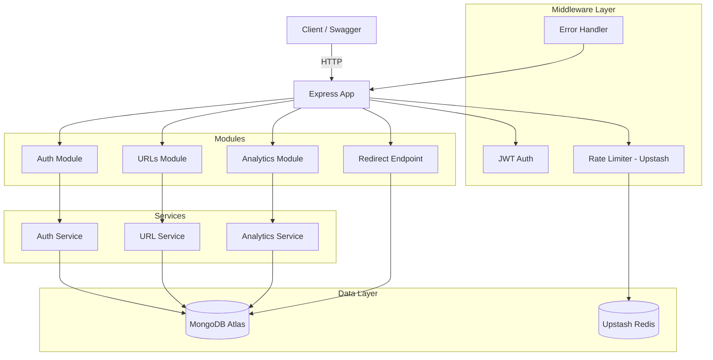

# URL Shortener API with Click Analytics

A production-ready REST API that shortens URLs and tracks detailed click analytics per shortened link. Built with a clean layered architecture (controllers → services → repositories), async click logging, Redis caching/rate limiting, and JWT auth with refresh token rotation.

## Live Demo

- **API:** [https://url-shortener-04gp.onrender.com](https://url-shortener-04gp.onrender.com)
- **Swagger UI:** [https://url-shortener-04gp.onrender.com/api/docs](https://url-shortener-04gp.onrender.com/api/docs)

## Stack


## Architecture



## Design Decisions

### Why TypeScript (strict mode)?
Catches entire classes of bugs at compile time — null references, missing properties, incorrect types. `strict: true` with `noUnusedLocals` and `noImplicitReturns` forces deliberate, clean code. No `any` anywhere.

### Why Express over Fastify/NestJS?
Express is the most widely understood Node.js framework. For a project of this scope, Express + clean folder conventions gives you the same architectural benefits as NestJS without the framework lock-in or decorator magic.

### Why a 3-layer architecture (controller → service → repository)?
- **Controllers** handle HTTP concerns only: parse request, call service, send response. Zero business logic.
- **Services** contain all business rules and orchestration. Testable without HTTP or DB.
- **Repositories** own all database queries. Return plain objects, not Mongoose documents. This means you could swap MongoDB for PostgreSQL by changing only the repository files.

### Why Mongoose (not raw driver)?
Mongoose provides schema validation, type casting, and a mature ODM layer. For a URL shortener with relational-ish data (users, urls, clicks), Mongoose's population and aggregation pipeline save hundreds of lines of boilerplate.

### Why Upstash Redis (not ioredis)?
Render's free tier doesn't support persistent Redis connections. Upstash provides a REST-based Redis that works perfectly on serverless/free-tier hosts. `@upstash/ratelimit` sits on top for rate limiting with zero infrastructure.

### Why async click logging?
The redirect endpoint (`GET /:shortCode`) must respond as fast as possible. Click analytics (IP hashing, user-agent parsing, geo-lookup via ip-api.com) are fire-and-forget — the redirect `302` is sent before the analytics are persisted.

### Why SHA-256 for IPs?
Privacy-first analytics. Raw IPs are never stored — only a SHA-256 hash. This means we can count unique visitors per URL without being able to identify individuals.

## Local Setup

```bash
# Prerequisites: Docker Desktop
docker-compose up
```

The API will be available at `http://localhost:3000` and Swagger at `http://localhost:3000/api/docs`.

MongoDB runs on `localhost:27017`, Redis on `localhost:6379`. Hot-reload is enabled via volume mount.

### Without Docker

```bash
npm install
# Start MongoDB on localhost:27017 and Redis on localhost:6379
npm run dev
```

### Tests

```bash
npm test
```

## API Overview

| Method | Endpoint | Auth | Rate Limit | Description |
|--------|----------|------|------------|-------------|
| POST | `/auth/register` | No | 10/min | Create account |
| POST | `/auth/login` | No | 10/min | Login |
| POST | `/auth/refresh` | Cookie | — | Rotate refresh token |
| POST | `/auth/logout` | Bearer | — | Invalidate refresh token |
| POST | `/urls` | Bearer | — | Create short URL |
| GET | `/urls` | Bearer | — | List URLs (paginated) |
| GET | `/urls/:id` | Bearer | — | Get URL details |
| DELETE | `/urls/:id` | Bearer | — | Soft delete URL |
| GET | `/:shortCode` | No | 60/min | Redirect to original URL |
| GET | `/urls/:id/analytics` | Bearer | — | Click analytics |

## Environment Variables

| Variable | Required | Description |
|----------|----------|-------------|
| `NODE_ENV` | No | `development`, `production`, or `test` |
| `PORT` | No | Server port (default: 3000) |
| `MONGODB_URI` | Yes | MongoDB connection string |
| `JWT_ACCESS_SECRET` | Yes | JWT signing secret (access token, 15min) |
| `JWT_REFRESH_SECRET` | Yes | JWT signing secret (refresh token, 7d) |
| `BASE_URL` | Yes | Public base URL for short links |
| `UPSTASH_REDIS_REST_URL` | Production | Upstash Redis REST URL |
| `UPSTASH_REDIS_REST_TOKEN` | Production | Upstash Redis REST token |

## Deploy

```bash
# 1. Push to GitHub
git push origin main

# 2. Render auto-deploys (render.yaml detected)
```

Free services used: **Render** (web app), **MongoDB Atlas M0** (512MB), **Upstash Redis** (10k req/day).

## What I'd Add With More Time

- **QR code generation** for each short URL (a simple GET endpoint that returns a QR PNG)
- **Link grouping / folders** for organizing URLs by project or campaign
- **Batch URL creation** via CSV upload
- **Webhook notifications** when a URL reaches a click threshold
- **Custom domains** per user (e.g., `links.yourdomain.com/abc`)
- **Rate limit tiers** based on plan (free: 60/min, pro: 600/min)
- **Admin panel** (React frontend) for non-technical users
- **Prometheus metrics** endpoint for monitoring
- **Redis caching** of popular short URLs to reduce DB reads on redirect
